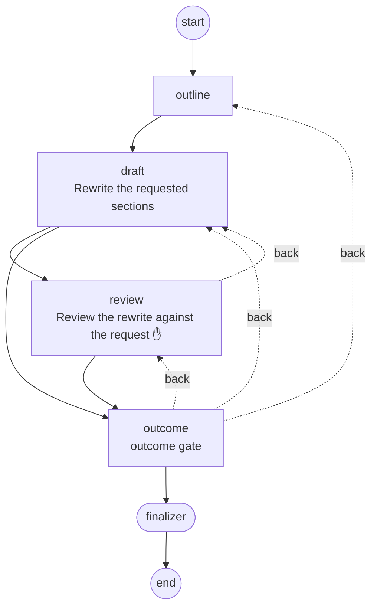

```mermaid
flowchart TD
  start((start))
  u0["outline"]
  u1["draft<br/>Rewrite the requested sections"]
  u2["review<br/>Review the rewrite against the request ✋"]
  u3["outcome<br/>outcome gate"]
  fin([finalizer])
  stop((end))
  start --> u0
  u0 --> u1
  u1 --> u2
  u1 --> u3
  u2 --> u3
  u2 -.->|back| u1
  u3 --> fin
  u3 -.->|back| u0
  u3 -.->|back| u1
  u3 -.->|back| u2
  fin --> stop

```
