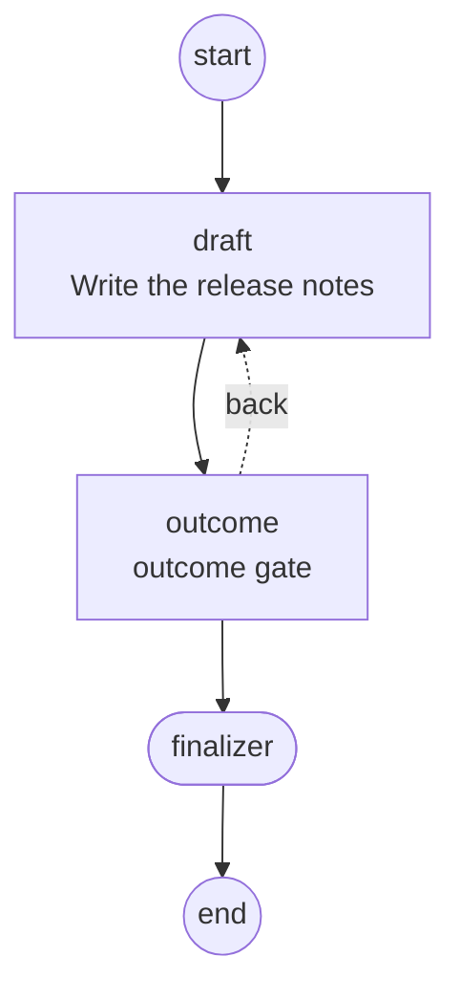

```mermaid
flowchart TD
  start((start))
  u0["draft<br/>Write the release notes"]
  u1["outcome<br/>outcome gate"]
  fin([finalizer])
  stop((end))
  start --> u0
  u0 --> u1
  u1 --> fin
  u1 -.->|back| u0
  fin --> stop

```
