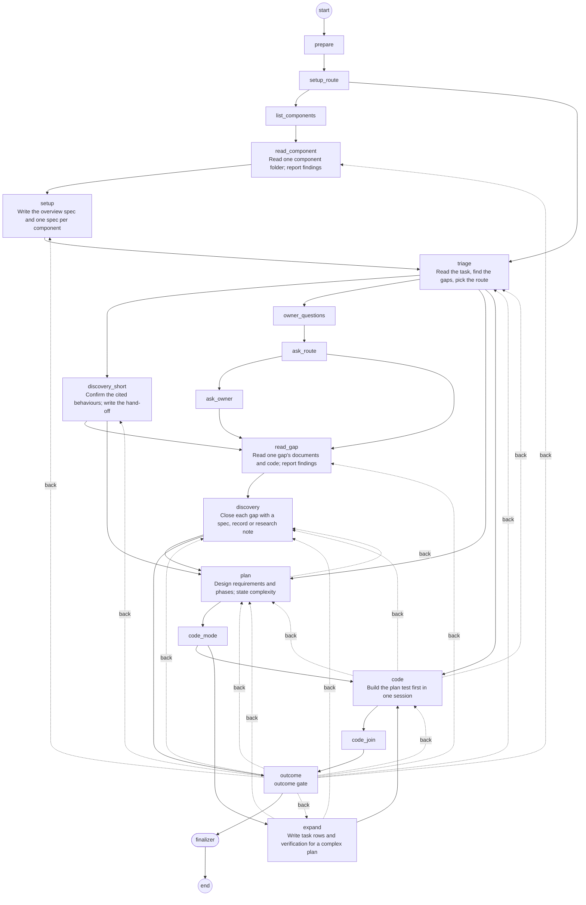

```mermaid
flowchart TD
  start((start))
  u0["prepare"]
  u1["setup_route"]
  u2["list_components"]
  u3["read_component<br/>Read one component folder; report findings"]
  u4["setup<br/>Write the overview spec and one spec per component"]
  u5["triage<br/>Read the task, find the gaps, pick the route"]
  u6["discovery_short<br/>Confirm the cited behaviours; write the hand-off"]
  u7["owner_questions"]
  u8["ask_route"]
  u9["ask_owner"]
  u10["read_gap<br/>Read one gap's documents and code; report findings"]
  u11["discovery<br/>Close each gap with a spec, record or research note"]
  u12["plan<br/>Design requirements and phases; state complexity"]
  u13["code_mode"]
  u14["expand<br/>Write task rows and verification for a complex plan"]
  u15["code<br/>Build the plan test first in one session"]
  u16["code_join"]
  u17["outcome<br/>outcome gate"]
  fin([finalizer])
  stop((end))
  start --> u0
  u0 --> u1
  u1 --> u2
  u1 --> u5
  u2 --> u3
  u3 --> u4
  u4 --> u5
  u5 --> u6
  u5 --> u7
  u5 --> u12
  u5 --> u15
  u6 --> u10
  u6 --> u12
  u7 --> u8
  u8 --> u9
  u8 --> u10
  u9 --> u10
  u10 --> u11
  u11 --> u12
  u11 --> u17
  u12 --> u13
  u12 -.->|back| u11
  u13 --> u15
  u13 --> u14
  u14 --> u15
  u14 -.->|back| u12
  u14 -.->|back| u11
  u15 --> u16
  u15 -.->|back| u12
  u15 -.->|back| u11
  u15 -.->|back| u5
  u16 --> u17
  u17 --> fin
  u17 -.->|back| u3
  u17 -.->|back| u4
  u17 -.->|back| u5
  u17 -.->|back| u6
  u17 -.->|back| u10
  u17 -.->|back| u11
  u17 -.->|back| u12
  u17 -.->|back| u14
  u17 -.->|back| u15
  fin --> stop

```
