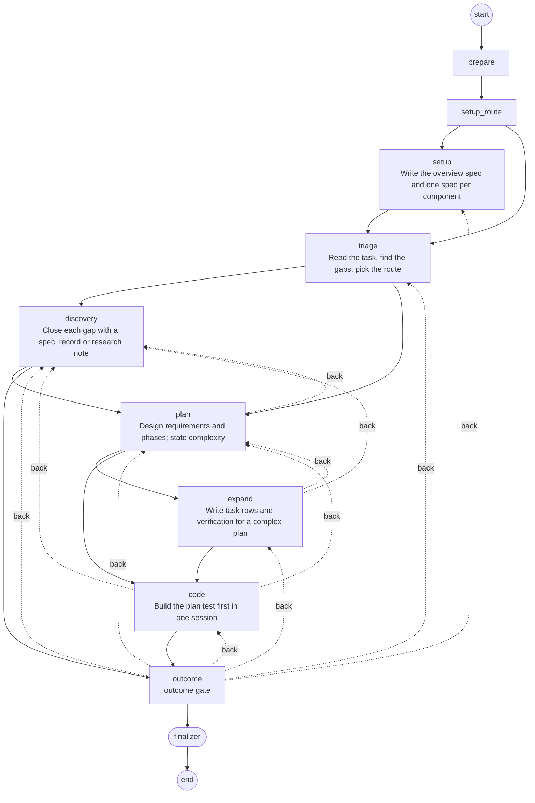

```mermaid
flowchart TD
  start((start))
  u0["prepare"]
  u1["setup_route"]
  u2["setup<br/>Write the overview spec and one spec per component"]
  u3["triage<br/>Read the task, find the gaps, pick the route"]
  u4["discovery<br/>Close each gap with a spec, record or research note"]
  u5["plan<br/>Design requirements and phases; state complexity"]
  u6["expand<br/>Write task rows and verification for a complex plan"]
  u7["code<br/>Build the plan test first in one session"]
  u8["outcome<br/>outcome gate"]
  fin([finalizer])
  stop((end))
  start --> u0
  u0 --> u1
  u1 --> u2
  u1 --> u3
  u2 --> u3
  u3 --> u4
  u3 --> u5
  u4 --> u5
  u4 --> u8
  u5 --> u6
  u5 --> u7
  u5 -.->|back| u4
  u6 --> u7
  u6 -.->|back| u5
  u6 -.->|back| u4
  u7 --> u8
  u7 -.->|back| u5
  u7 -.->|back| u4
  u8 --> fin
  u8 -.->|back| u2
  u8 -.->|back| u3
  u8 -.->|back| u4
  u8 -.->|back| u5
  u8 -.->|back| u6
  u8 -.->|back| u7
  fin --> stop

```
