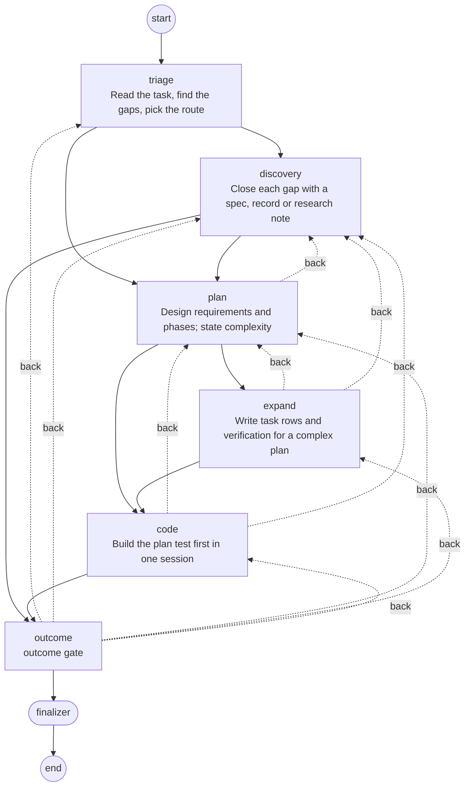

```mermaid
flowchart TD
  start((start))
  u0["triage<br/>Read the task, find the gaps, pick the route"]
  u1["discovery<br/>Close each gap with a spec, record or research note"]
  u2["plan<br/>Design requirements and phases; state complexity"]
  u3["expand<br/>Write task rows and verification for a complex plan"]
  u4["code<br/>Build the plan test first in one session"]
  u5["outcome<br/>outcome gate"]
  fin([finalizer])
  stop((end))
  start --> u0
  u0 --> u1
  u0 --> u2
  u1 --> u2
  u1 --> u5
  u2 --> u3
  u2 --> u4
  u2 -.->|back| u1
  u3 --> u4
  u3 -.->|back| u2
  u3 -.->|back| u1
  u4 --> u5
  u4 -.->|back| u2
  u4 -.->|back| u1
  u5 --> fin
  u5 -.->|back| u0
  u5 -.->|back| u1
  u5 -.->|back| u2
  u5 -.->|back| u3
  u5 -.->|back| u4
  fin --> stop

```
